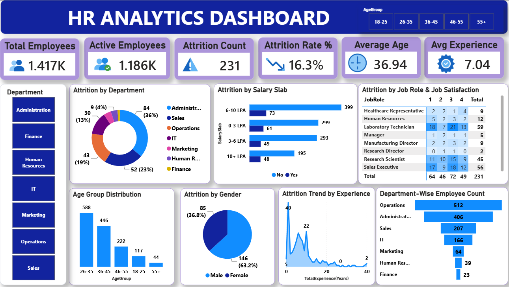

# 📊 HR Analytics Dashboard | Power BI

An interactive **HR Analytics Dashboard** built using **Microsoft Power BI** to analyze employee data, workforce trends, and attrition patterns. This dashboard enables HR professionals to gain actionable insights into employee demographics, performance, and retention, supporting data-driven decision-making.

---

# 📌 Project Overview

The **HR Analytics Dashboard** transforms employee data into meaningful business insights using Microsoft Power BI. It helps organizations monitor workforce metrics, identify attrition trends, and analyze employee demographics through interactive visualizations.

---

# 📷 Dashboard Preview



---

# 🎯 Project Objectives

- Analyze employee attrition and retention trends.
- Monitor workforce demographics.
- Compare department-wise employee distribution.
- Evaluate job role performance.
- Identify education-wise and age-wise attrition patterns.
- Build an interactive HR dashboard for data-driven decision-making.

---

# 📊 Dashboard Features

✅ Employee Overview

✅ Attrition Analysis

✅ Department-wise Employee Distribution

✅ Job Role Analysis

✅ Education-wise Attrition

✅ Gender Distribution

✅ Age Group Analysis

✅ Salary Analysis

✅ Interactive Slicers & Filters

✅ Business-friendly Dashboard Design

---

# 📈 Key Insights

- Track overall employee count and attrition rate.
- Compare attrition across departments and job roles.
- Analyze workforce distribution by age and gender.
- Identify education levels with higher attrition.
- Explore salary distribution and employee demographics.
- Filter insights dynamically using interactive slicers.

---

# 🛠️ Tools & Technologies

- Microsoft Power BI
- Power Query
- DAX (Data Analysis Expressions)
- Data Modeling
- Data Cleaning
- Data Visualization
- Business Intelligence

---

# 📂 Repository Structure

```text
HR-Analytics-Dashboard/
│
├── HR Project.pbix
├── HR_Analytics-4.csv
├── Images/
│   └── dashboard.png
├── README.md
├── LICENSE
└── .gitignore
```

---

# 📊 Dataset

The dataset includes:

- Employee ID
- Age
- Gender
- Department
- Job Role
- Education
- Monthly Income
- Years at Company
- Attrition Status
- Performance Rating
- Job Satisfaction
- Work-Life Balance

---

# 💼 Skills Demonstrated

- Data Cleaning
- Data Transformation
- Data Modeling
- DAX Calculations
- Power Query
- Dashboard Design
- KPI Development
- Business Intelligence
- Data Storytelling
- Interactive Reporting

---

# 🚀 Future Enhancements

- Real-time HR data integration
- Predictive attrition analysis
- Employee performance forecasting
- Mobile-optimized dashboard
- AI-powered HR insights

---

# ⭐ Why This Project?

This dashboard demonstrates how Power BI can transform HR data into actionable insights through interactive visualizations and business intelligence. It showcases practical skills in data modeling, DAX, Power Query, KPI development, and dashboard design.

---

# 📬 Connect With Me

**LinkedIn:**  
https://www.linkedin.com/in/kotra-chandra-prakash

**GitHub:**  
https://github.com/Chandu20036

---

## ⭐ If you found this project useful, please consider giving it a Star!

Thank you for visiting this repository.

---

## 📄 License

This project is licensed under the MIT License.
